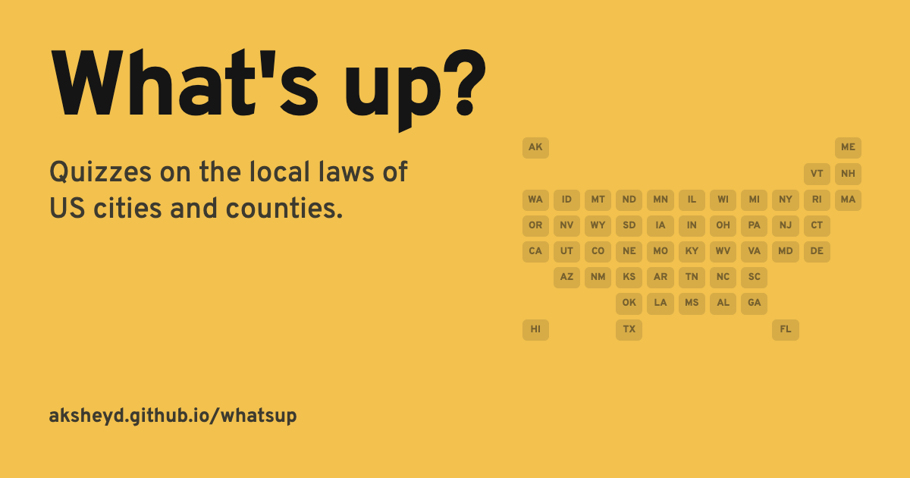

# What's Up?

How well do you know the local laws where you live?

What's Up? is a quiz about the rules in your city or county: when the parks close, where your dog needs a leash, what you can build without a permit, and plenty of other things nobody reads until they need to.

**[Play at aksheyd.github.io/whatsup](https://aksheyd.github.io/whatsup/)**



## How to play

1. Pick a state on the map, or press **Surprise me** to jump to a random town.
2. Choose a city or county.
3. Answer a few multiple-choice questions about its local laws.
4. After each answer, read the passage the question came from, or open the full ordinance.

There are about 16,700 questions for more than 3,500 cities and counties in all 50 states.

## Where the questions come from

Every city and county publishes a code of ordinances, which collects the local laws it has passed. Grok, the AI model from xAI, wrote the questions from short passages of those codes. Each question links to the full ordinance on Municode, the site many cities use to publish their codes, so you can check the answer yourself.

## A friendly warning

This is a game, not legal advice. It's unofficial and not affiliated with any city, county, or Municode. Laws change, AI makes mistakes, and a few links point to the wrong section, so read the ordinance itself before you rely on an answer.

## The story

What's Up? started at the University of Michigan Data Driven Hackathon in March 2025. It came back in September 2026 with a new design and quizzes for thousands of places.

<details>
<summary>For developers</summary>

The site is plain TypeScript and CSS built with Vite, with no framework. A small Python pipeline builds the quiz data as JSON.

### Run the site

```bash
cd site
npm install
npm run dev
```

Then open http://localhost:5173. Every push to `main` deploys the site to GitHub Pages.

### What's where

| Path | What it holds |
|---|---|
| `site/` | The website |
| `pipeline/` | Python code that builds the quiz data |
| `data/published/` | The questions the site serves, one file per state |
| `data/urls/` | Lists of code pages for each city and county |

### Rebuild the quiz data

You need Python 3.11 or newer and an [xAI API key](https://console.x.ai).

```bash
python3 -m venv .venv
source .venv/bin/activate
pip install -r pipeline/requirements.txt
python -m playwright install chromium
cp .env.example .env    # then add your XAI_API_KEY

python -m pipeline catalog                        # list every city and county
python -m pipeline scrape --state mi --limit 5    # fetch ordinance text for a few places
python -m pipeline generate --state mi --limit 5  # write questions for them
python -m pipeline status                         # count the fetched excerpts
```

`generate` asks xAI's `grok-4.6` model for the questions. Pass `--model` to use a different xAI model. Fetched text goes to `data/raw/` and model logs go to `.traces/`. Git ignores both folders.

</details>

## License

The code is MIT licensed. See [LICENSE](LICENSE).
